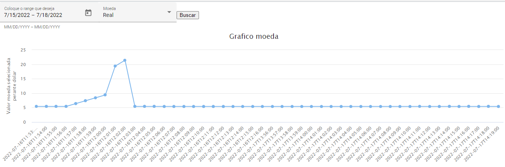

# currency
data capture to build currency charts

The project consists of a simple system that consumes an api from the https://www.vatcomply.com/documentation
and generates the necessary data to build 1 minute candles.

clone the project: git clone https://github.com/Hdlara/moeda.git

## Setting

This app is using
<table>
	<tr>
		<td>Django</td>
		<td>Python</td>
		<td>Angular</td>
	</tr>
	<tr>
		<td>3.1.2</td>
		<td>3.8.12</td>
		<td>12</td>
	</tr>
</table>

### Docker

See installation instructions at: https://docs.docker.com/get-docker/

### Docker Compose

Install docker compose , see installation instructions at: https://docs.docker.com/compose/install/

## Build and run the container

run:
```
docker-compose up
```

## Run migrate and create the Admin user

After the container started we will run the commands:

```
docker-compose moeda_backend_1 web python manage.py makemigrations
docker-compose moeda_backend_1 web python manage.py migrate
```
command to create an admin user:

```
docker-compose exec moeda_backend_1 python manage.py  createsuperuser
```

After starting it will be necessary to call the service that makes the requests for the currency (every time you start it will be necessary) if you don't accept next week I will implement the call of the same automatically when the server starts.

http://localhost:8000/candle

As the service runs in a loop, there will be no response other than a time out so after performing open the docker console and a message 'Chamada iniciada' will appear ensuring that the service is ok.

Working example
